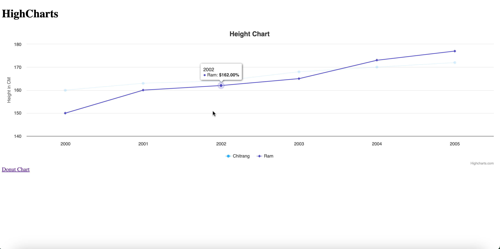
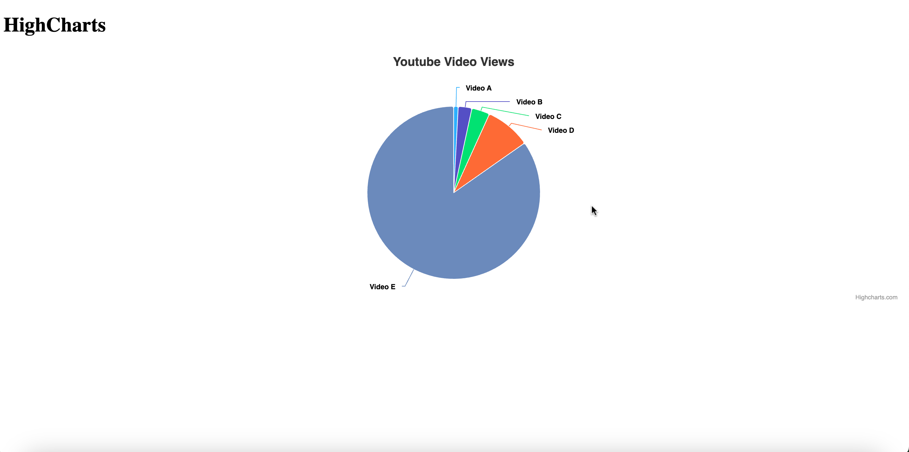
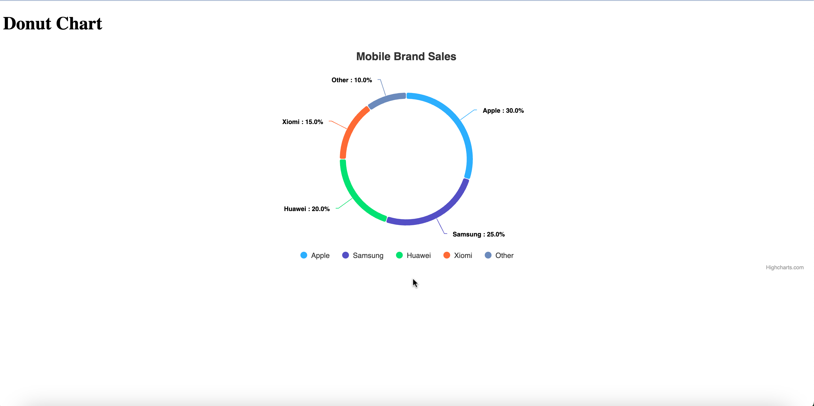

# Charting with Highcharts

This repository contains examples of various charts created using Highcharts. You can view live demos and screenshots of each chart type:

## Line Chart

- **File**: `lineChart.html`
- **Description**: A simple line chart demonstrating trends over time.
- **Screenshot**:
  

## Pie Chart

- **File**: `pieChart.html`
- **Description**: A pie chart displaying data distribution in a circular format.
- **Screenshot**:
  

## Donut Chart

- **File**: `donutChart.html`
- **Description**: A donut chart, a variant of the pie chart, showing data as segments in a donut shape.
- **Screenshot**:
  

### How to Use

1. Clone the repository to your local machine.
2. Open the HTML files (`lineChart.html`, `pieChart.html`, `donutChart.html`) in your web browser to view the live chart examples.

Feel free to explore and use these chart examples as a reference for your Highcharts projects. If you have any questions or suggestions, please open an issue or reach out to us.

Happy charting!
